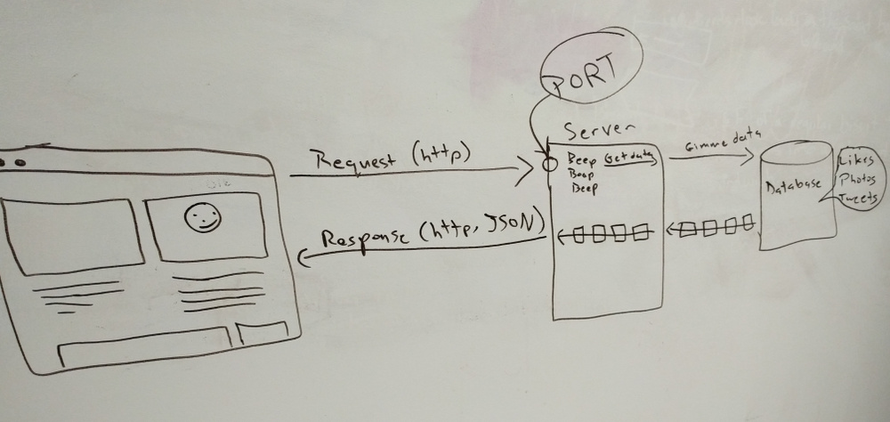
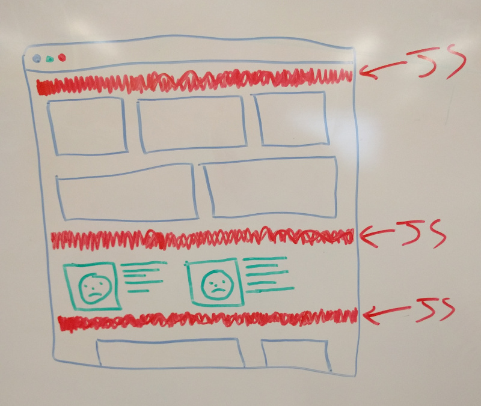
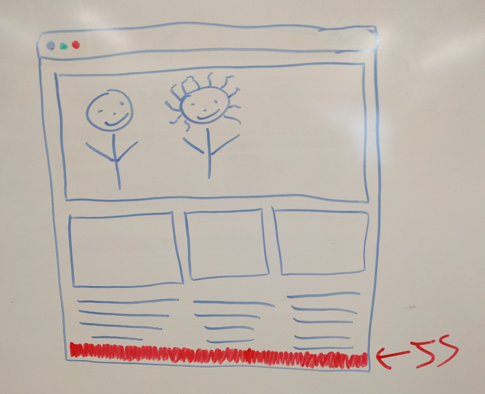

#  Working with JavaScript on the Command line (3:00)

| Timing | Type |Topic|
| --- | --- | --- |
| 25 min | [Opening](#opening) | JavaScript & Web Technology |
| 35 min | [Codealong](#codealong1) | Introduction to the Terminal|
| 30 min | [Activity](#activity) | Client-Server Model |
| 30 min | [Codealong](#codealong3)  | JS in the Terminal with Node |
| 10 min | [Conclusion](#conclusion)| Final Questions & Exit Tickets |

### Learning Objectives

- Differentiate between the internet and the world wide web.
- Understand the client-server model.
- Use the most common commands to navigate and modify files / directories via the terminal window.
- Initialize a local git repository and push/pull changes to a remote git repository.
- Run basic JavaScript script on the command line using Node.

### Preparation
*Before this lesson, students should already be able to:*

- Install and configure Node.js, npm, Git and other command line tools.
- Write pseudocode and think programmatically.
- Use HTML and CSS to create static web pages.

>Note: In the last class, we worked on getting our computers set up with command line tools like Git and Node. We also worked on a pseudocode exercise. Check with students to make sure that everyone is comfortable with the materials covered in the last class and has their command line utilities installed and configured.

---
<a name="opening"></a>
## JS & Web Tech (25 min)

Let's start by situating JavaScript in the broader web ecosystem and define a few terms:

* _Web Development_: The process of building sites and applications for the web.
* _Front-End Development_: The development of client / browser code (HTML, CSS, JS), i.e. what the user sees and interacts with.
* _Back-End Development_ : The development of server-side code that handles things like routing, data handling and databases (Ruby, Python, Java), i.e. the stuff "behind the scenes" that makes web applications work.

>Note: One good analogy to use here is to imagine that a house is a web app and then go through the house and identify the different parts of the stack. For example, the drywall might be HTML (structure), the paint might be CSS (styling) and elements like door handles and faucets might be JavaScript (user interaction). Systems that are essential yet mostly invisible to the user--the electric wiring, heating and cooling systems, plumbing--would represent the back-end.

#### What can JavaScript do?

* Historically, JavaScript has been used mostly to add interactive elements--like animations, buttons and user input forms--on the front-end. Increasingly, it is also being used to interact with APIs and databases and perform back-end tasks.
* JavaScript is very easy to implement. All you need to do is put your code in the HTML document and tell the browser that it is JavaScript.
* JavaScript works on web users’ computers — even when they are offline!
* JavaScript allows you to create highly responsive interfaces that improve the user experience and provide dynamic functionality, without having to wait for the server to react and show another page.
* JavaScript can load content into the document if and when the user needs it, without reloading the entire page — this is commonly referred to as Ajax.
* JavaScript can test for what is possible in your browser and react accordingly — this is called principles of unobtrusive JavaScript or sometimes defensive scripting.

#### The Downside of JavaScript

* JavaScript is flaky. Not the language itself but the environment it is implemented in. You don’t know what computer is on the receiving end of your web page, you don’t know how busy the computer is with other things and you don’t know if some other JavaScript open in another tab of the browser is grinding things down to a halt.
* JavaScript (or some of its functions) is occasionally turned off in browsers because of security concerns, or because JavaScript is often used to annoy people rather than improving their experience. For example, you will still find a lot of sites that try to pop up new windows against your wishes, or cover the content with advertising until you click a link to get rid of it.

[WAT](https://www.destroyallsoftware.com/talks/wat)

Citation: [W3C](https://www.w3.org/community/webed/wiki/What_can_you_do_with_JavaScript)

#### Node.js

>Note: Students should be made aware that we will be using Node during unit 1 so that we can run JavaScript on the command line. This will allow us to learn the fundamentals of programming and the syntax of JavaScript without the distractions of the browser.

While we won't be using node in the class as a framework, we will be using it as simple means to interpret JS code in the class. Regardless, it's good to know about current frameworks and why we would ever want to use a framework. Here's a bit more about Node.js.

The makers of Node.js took JavaScript (which normally only runs in the browser) and made it available on the server side (and on your computer!). A lot of developers and companies are excited because it allows you to build fast, scalable APIs and sites in JavaScript. JavaScript is already immensely popular and being able to use JS on the back-end gives us the option to use a single programming language throughout an entire full-stack application.

This is very helpful for engineers because it results in less context switching. Switching between JavaScript, HTML, CSS and a back-end language (Ruby, Python, PHP, Java, etc) is time consuming. By using a single language, we can avoid all that back and forth and it makes for super efficient work.

On top of that, one of the big differences is that Node.js is designed to be event-driven and asynchronous. While earlier frameworks can only do one thing at a time, Node purposefully sends nearly everything to the background and keeps going.

Imagine a paper delivery boy riding on his bike delivering papers every morning. Imagine he stops at each house, throws the paper on your doorstep, and waits to make sure you come out & pick it up before moving on to the next house. That would be what we'd call blocking – each line of code finishes before moving on to the next line of code.

Now imagine the paperboy throwing the newspaper on your porch but never stopping his bicycle; never stopping, he just keeps throwing papers on porches, so that by the time you pick it up he'll be 3 or 4 houses down. That would be non-blocking, or asynchronous. And that's what makes Node so powerful.


#### Frameworks

> Note: Due to the increasing popularity of front-end frameworks, many students will wonder when they'll be learning Angular/React/Ember/etc. The purpose of this section is to set clear expectations for what will be covered in the course and why. Toward the end of the course, you will have an opportunity to teach [an intro lesson on a JS framework of your choice](../16-instructor-student-choice/readme.md)--it's highly recommended that you mention that now, to give students who are excited about frameworks something to look forward to.

* Like all programming languages, there are a number of frameworks and libraries available that extend JavaScript's native capabilities. In this class, we'll be using frameworks like Node.js, jQuery and Handlebars.

* In recent years, a certain type of framework has become very popular that brings the MVC (Model View Controller) concept from back-end languages to front-end JavaScript. You've probably heard about some of these frameworks like Angular, React, Ember and Backbone.

* These frameworks are very powerful--they're also quite complex and technical. In order to learn how to leverage these sorts of frameworks, you'll need to have a strong grasp of the fundamentals of JavaScript, jQuery, APIs, the DOM and the browser. The majority of this class will focus on these fundamentals; toward the end, we'll introduce you to more advanced frameworks and concepts like the MVC model.

* The world of frameworks is evolving at a rapid pace. More important than knowledge of any one framework is an ability to learn new tools quickly. The skills that you learn in this class will give you a strong foundation in JavaScript so that you can go on to learn any framework or library more easily in the future.

---
<a name="codealong1"></a>

## Client - Server Model (30 min)

***Question: How exactly does communication between computers and networks take place?***

>Note: Ask students to create a diagram of the client-server model on a whiteboard and explain their reasoning. When they are done, give your own explanation and explain how the following vocabulary relate to one another: host, client, HTTP, request, response. Draw/pull up the diagram below as needed.  

Communication between a host, such as a computer, and a client, a requesting program such as a browser, occurs via a request/response pair. The client initiates an HTTP (Hyper Text Transfer Protocol) request message, which is serviced through a HTTP response message in return. In short, the client makes a request and based on that request, the server responds.

A server may receive requests from many different clients in a very short period of time. Because the computer can perform a limited number of tasks at any moment, it relies on a scheduling system to prioritize incoming requests from clients in order to accommodate them all in turn. To prevent abuse and maximize uptime, the server's software limits how a client can use the server's resources. Even so, a server is not immune from abuse. A denial of service attack exploits a server's obligation to process requests by bombarding it with requests incessantly. This inhibits the server's ability to respond to legitimate requests.

Of course, this is a somewhat abstract explanation of how this all works - there are a ton of intricacies that go into getting your request message to the right place and delivering the information you requested.



- **Host** - A computer or other device connected to a computer network; the host may offer information resources, services, and applications (via computer code!) to users or other computers on the network.
  - Ex: servers and web services


- **Client** - The requesting program in the client/host relationship; the client initiates an HTTP request message, which is serviced through a HTTP response message in return.
  - Ex: browsers, terminals, mobile devices


- **HTTP** - Stands for "Hyper Text Transfer Protocol" - because it's a protocol, it allows for communication between a variety of different computers and supports a ton of different network configurations. To make this possible, it assumes very little about a particular system.
    - Read this as: "HTTP makes it easy for many different computers to talk to each other."

_Text From [Tuts +](http://code.tutsplus.com/tutorials/http-the-protocol-every-web-developer-must-know-part-1--net-31177)_

#### IP Addresses and Domains: Reaching a Specific Server

All computers on the internet have a unique numeric address composed of four bytes of data, separated by periods. This is the way computers find "each other" when communicating. You may recognize the format below - it's an IP address:

  ```
  123.123.123.123
  ```

Of course, these numbers are hard to remember, and are not really human-friendly. Can you imagine if website addresses had to be given this way? Instead of commercials on the radio saying "go to OurWebsite.com", they'd be saying "go to 12.14.142.231" and repeating it five times just to make sure everyone got it!

So what was needed was a way to translate real names in to those numbers. This is why we have domain registrars - basically, you reserve the name, and at the domain registrar, your domain name is pointed to the server's particular unique address.

When you type a website domain in to your web browser (or other internet capable app), what happens is a "DNS Lookup" of that particular domain's IP address, so your computer can actually connect to it.  DNS stands for "Domain Name System", and it's the way that Internet domain names are located and translated into Internet Protocol addresses.

| Domain Name | IP Address |
| --- | --- |
| apple.com | 17.172.224.47 |
| facebook.com | 31.13.65.1 |
| google.com | 216.58.192.46 |

Your internet provider has a nice little cached list of all of the registered domains - and their respective IP addresses - so when you go to apple.com, your browser asks the DNS server "what is the IP address of apple.com?" The DNS server responds with "17.172.224.47", and the browser can then connect to 17.172.224.47.

In real world terms, it's like how we use street addresses for finding a house, rather than using Latitude and Longitude coordinates - they're easier to remember and to read.

---

<a name="codealong3"></a>

## Introduction to the Terminal (35 min)

We learned how to execute some scripts on the command line during installfest. You'll soon find that the command line is the heart of your operating system. Almost anything that you can do from a GUI (Graphical User Interface), you can also do from the command line, but FASTER! We'll learn how to navigate computer files and folders using the terminal, because it'll help us get situated with pushing our projects to Github.  

#### Command Line Basics

Here are some common UNIX commands that you'll want to get familiar with as they'll be important for you to know as you're working on the terminal!


| Command | Description | Command| Description |
| --- | --- | --- | --- |
| `ls` | List the contents of the directory | `atom` | Open Atom|
| `cd` | Change directories| `pwd`|Present working directory |
| `mkdir` | Create a new folder | `say`| Make your computer talk |
| `rmdir` | Remove an empty folder  | `open`|Open a particular file in their default application|
| `rm` | Remove a file | `./`  | The current folder|
| `touch` | Create an empty file | `../`| One folder above your current working directory
| `echo` | Return a string |  `~/` | The home folder  |

#### Command Line Codealong

**For Macs**:
  * Open the "Terminal" app (Applications > Utilities > Terminal)
  * Optionally, download and install [iTerm 2](https://www.iterm2.com/), which is a replacement for the Terminal app that is more configurable.

**For Windows**:
 * Open the "Command Prompt" application.
 * For a better experience, try [Console](http://sourceforge.net/projects/console/).


**Get familiar with basic the basic commands on the terminal!**


1.  Navigate to your Documents Folder from your root directory. ```cd ~``` and then ```cd Documents```

2. Create a directory named advanced_js.  ```mkdir advanced_js```

3. Change into this directory. ```cd advanced_js```

4. Create a file named "index.html" using the touch command. ```touch index.html```

5. Demonstrate how to open "index.html" in Atom from the terminal. ```atom```

6. Have students set up Atom for their working environment. (Show them the open files side bar)

7. Using HTML comments type "This is how you should take notes in class." Some students will need a refresher on how to write HTML comments (i.e. `<!-- comment -->`). Briefly explain comments and let them know we'll be talking more about comments in the next lesson.

8. Create an empty directory within the Advanced JS folder and remove it. ```mkdir test_folder ``` and ```rmdir test_folder ```

>Note: Make sure to explain each command while students code along. Switch back to the finder often so students can make a connection to how the GUI and CLI function.

**Bonus**

1. Write a sentence with a directory structure and print it using the `pwd` command. Use your home directory as the starting point

For example: `Johnny loves JavaScript`

Create a directory structure that prints

```/Users/johnny/loves/javascript```

#### More Independent Practice

Complete the following instructions below in the Terminal application.

1. Create a folder in your ~/Sites/ folder titled goals.

2. Once inside that folder, create three empty files:
  - goals.html
  - worries.html
  - index.html

3. Open Atom, click File > Open and navigate to your newly created ~/Sites/goals folder.
  In the respective files (goals.html and worries.html), write your top 3 goals and top 3 worries for this course.

4. Paste the following contents into index.html:

  ```javascript
  <html>
  <head></head>
  <body>
    <a href="goals.html"></a>
    <br>
    <a href="worries.html"></a>
  </body>
  </html>
  ```

5. Open index.html with your browser and make sure you see your goals and worries.

---
<a name="activity"></a>


## Browser Rendering (15 min)
Browser rendering doesn't happen all at once. JavaScript plays a BIG role in how quickly a page renders. Let's discuss.

1. Script tags where ever



2. Script tags at the bottom



---
<a name ="browser-rendering"></a>

## JS in the Terminal (30 min)

Typically you'd run JS in the browser, but in order to get comfortable with using the terminal and working like programmer, we'll be focusing on using JS on the command line during the first unit of this class. Remember when we installed Node and npm? We'll be using these runtime platforms to make scripts run in the terminal. Node.js is actually a JavaScript framework, however, for the purposes of this class, we'll only be using Node as a command line interpreter.


### Executing a JS program: Codealong

Starting next class, we'll be creating our own JavaScript files and building things out. But before we dive in, we want to explore the power of the terminal and run JavaScript inside of it.

As we've discussed before, the Terminal is like your universal Swiss Army knife. It will always be with us moving forward and for now it helps us focus our learning. The computer has always had a text-only interface. Some of you may remember DOS or the early text only games before complex graphical interfaces. The terminal is a tool from that era that professional developers still use every day.


#### Part 1: Write and execute some code in a file!

1. In your working directory, start the Node console by typing in ```node```

2. Now we can type in some JavaScript and see what happens.
Let's start off with a classic programming exercise, printing 'Hello World'.

 `console.log('Hello World')`

 You should see Hello World printed. Underneath you will see that it is undefined, which just means that it is a variable, but it hasn't been defined. We just wrote our first bit of Node / JavaScript!

3. Now we can start to see how things work that are a bit more complex. Let's drop in some variables:

  `var x = 5;
    var y = 2;`

4. We can also then print these variables to our console by typing ```console.log(x)```. Just like in normal JavaScript, we do not include quotes around variables around like we do with 'Hello World'.

>Note: Ask the class why this is and make sure they understand the difference between logging variables and strings as a pre-cursor for the next lesson on datatypes--we frequently see students get hung up on logging variables with quotes and strings without quotes.

#### Part 2: Let's do some basic math!

  1. What happens if you do:

    `x + y`

    or

    `y * 4`

  2. We can even update the variable like this:

    `x = 9`

  3. Now if we add x and y together we get a different result.

    `x + y`

  4. While this is obviously the tip of the iceberg, it starts to lay the foundation for us in terms of what we will be able to accomplish in the near future.

    To exit the console hit CTRL + C. You may need to hit it again to officially close the console.

---
<a name="conclusion"></a>

## Exit Ticket

Before you leave, please take ~3 minutes to complete [this exit ticket](https://docs.google.com/forms/d/1LNeV7Vf043jg_4A1cBlHvFQkT_GiQAsl2a14jJjgYO0/viewform?c=0&w=1).

This helps us help you! We'll review responses for each exit ticket before the next lesson.


## Conclusion (5 min)

#### Review

Make sure the lesson objectives have been met.

* Summarize the client-server model.
* Explain the difference between the internet and the world wide web.
* Understand what GitHub does and why we'll be using it.
* Understand how we will be using Node in the class (as a JS interpreter, not necessarily a framework).

#### The Developer Mentality

Here are some tips that you'll want to keep in mind as your continue coding!

  * Choose the right OS, editors and tools for your projects. Remember to do your research.
  * Leverage the online community's vast libraries and documentation.
  * Be efficient: Use the keyboard as much as possible instead of the mouse.
  * If you find yourself doing the same thing repeatedly, automate it.

#### Further Resources

* [iTerm2](http://iterm2.com/)
* [Review Git](https://www.codeschool.com/courses/try-git)
