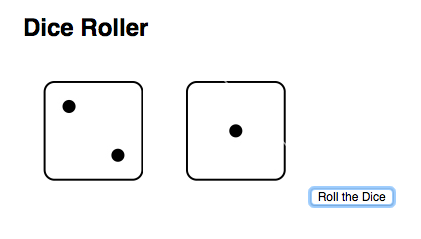
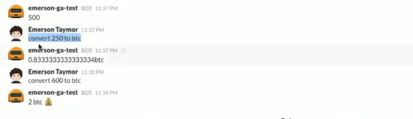

#  Functions and Scope (3:00)

| Timing | Type | Topic |
| --- | --- | --- |
| 10 min | [Opening](opening) | Introduction to Functions  |
| 20 min | [Codealong](#codealong1) | Function Declaration |
| 30 min | [Lab](#lab1) | Rolling Dice |
| 15 min | [Codealong](#codealong2) | Parameters |
| 15 min | [Codealong](#codealong3) |  The Return Statement |
| 10 min | [Introduction](introduction1) | Introduction to Scope |
| 15 min | [Codealong](#codealong4) | Local and Global Scope Usage |
| 15 min | [Lab](#lab3) | Hubot: Independent Practice + Bonus |
| 5 min | [Conclusion](#conclusion) | Final Questions & Exit Tickets |
| 45 min | [Bonus Labs](#lab2) | Currency Converters |

>Note: The content in this lesson can be challenging for students with limited programming experience. Make sure to check for understanding as you go and spend additional time on any of the following sections, if need be. If you manage to cover all of the material before class is over, there are additional bonus labs at the bottom of this lesson plan.

### Objectives

*After this lesson, students will be able to:*

- Describe how parameters and arguments relate to functions.
- Create and call a function that accepts parameters to solve a problem.
- Define and call functions defined in terms of other functions.
- Return a value from a function using the return keyword.
- Define and call functions with argument dependent return values.
- Know the scope of your local and global variables.
- Create a program that hoists variables.

### Preparation
*Before this lesson, students should already be able to:*

- use conditionals to control program flow.
- Differentiate between true, false, 'truth-y', and 'false-y'.
- Use boolean logic (!, &&, ||) to combine and manipulate conditionals.

>Note: Last class, we worked on data types, conditional statements, logical and comparison operators! Check with students to make sure that everyone is comfortable with the materials covered in the last class.

---
<a name="opening"></a>
## Introduction to Functions (10 min)

A function is a reusable statement, or a group of reusable statements, that can be called anywhere in the program so that the statements inside the function do not need to be written over and over again. Functions enable the software developer to segment large, unwieldy applications into smaller, more manageable pieces.

Functions are a critical component of programming because it allows us to execute on a key tenant of engineering, Don't Repeat Yourself, commonly referred to as DRY. Our goal is to craft our programs in as few lines of code as possible, while still being clear.

Another interesting thing about functions is that they are just like objects or strings. You can pass a function into other functions as an argument, and can also use it just like any other object we've been working with.

>Note: DRY doesn't mean you never do the same thing twice, it means you __never write the same code__ to do the same thing

---
<a name="codealong1"></a>
## Function Declaration (20 min)

Before we call, or "use", a function, we must define it. In JavaScript, functions can be defined in several ways. Two more common methods are __function declarations__ and __function expressions__.

__Function Declarations:__
```javascript
function speak () {
  console.log('hello');
}
```

__Function Expressions:__
```javascript
var speak = function () {
  console.log('hello');
}
```

While both methods are similar, an important difference between function declarations and function expressions involves the concept of __hoisting__. In JavaScript, function declarations are always moved, or "hoisted", to the top of their scope by the interpreter. In other words, you can call a function declaration before defining it:

```javascript
speak()

function speak() {
  console.log('hello')
}

// DOES NOT RESULT IN ERROR
```

Function expressions, however, must be defined before they are called:

```javascript
speak()

var speak = function () {
  console.log('hello')
}

// RESULTS IN ERROR:
// TypeError: undefined is not a function
```

#### Function Declaration Syntax

A function declaration always has the following:

* A name
* An optional list of parameters - the names of arguments to be "passed" into the function, or information the function will use - defined by the parenthesis before the opening curly brace
* Statements inside the function - this is the code executed every the function is called

In our example above, the function name is `speak`. The parameter is `words`. If we had multiple parameters it would be a comma separated list inside the parentheses `(words, num)` and the statement is `console.log(words);`

And this makes up a basic function declaration!

#### Calling Functions

Calling, or invoking, a function will execute the code defined inside this function.

Defining and calling a function is different - a function will not be called when it's defined.

You call a function by using parenthesis after the function's name `()`:

```javascript
function hello () {
  console.log("hello there!")
}

hello();

=> hello there!
```

Often, JavaScript functions will be defined as methods on objects. To call a function as a method:

```javascript
var person = {
  name: 'Obama',
  speak: function () {
    console.log('Hello, World!')
  }
}

person.speak()
=> 'Hello, World!'
```
---
<a name="lab1"></a>
## Rolling Dice: Lab (30 min)

For this lab, you'll be creating a page where every time the user hits the "Roll Dice" button, the screen randomly updates the two dice. Open the [app.js file](starter-code/dice/js/app.js). Use the html and css code included in the starter code folder to get started.



Before writing any code, make sure to write down the pseudocode for the exercise!

>Note: We haven't covered DOM Manipulation yet, but students will need to get some familiarity with [document.getElementById](https://developer.mozilla.org/en-US/docs/Web/API/Document/getElementById) to complete this exercise. Make sure to either hint at this or give them a short intro.

<a name="codealong2"></a>
## Parameters (15 min)

If we had a function that did the same thing every time it was called, it wouldn't make for the most powerful codebase. Furthermore, if we wanted to enable additional behaviors in our application, we would have to write a new function for each new feature:

```javascript
// Bad idea...
function helloMark () {
  console.log('hello, Mark');
}

function helloObama () {
  console.log('hello, Obama')
}
```

> __Instructor's Note:__ Ask students as to why writing such specific functions is a bad idea. If there are no immediate answers, ask what happens to the above program structure if there are 1,000 users. If we have to write 1,000 different functions, is this a scalable and maintainable program?

Parameters remedy this problem by allowing us to call, or invoke, the same function with different values:

```javascript
function sayHello (name) {
  console.log('Hello ' + name);
}

sayHello('Mark');
=> 'Hello Mark'

sayHello('Obama');
=> 'Hello Obama'
```

In this example, the function `sayHello` is declared with one parameter, `name`. To write functions with **more than one parameter**, use a comma separated list: `(param1, param2, param3, param4)`. In JavaScript, functions can accept up to 255 parameters!

```javascript
function sum(x, y, z) {
  console.log(x + y + z)
}

sum(1, 2, 3);
=> 6
```

JavaScript is a loosely, or weakly (as opposed to "strongly") typed language. This means that when writing functions, one do not need to specify the data-type (string, number, etc.) of the function's parameters. While this reduces the overall amount of code the programmer must write, it makes JavaScript particularly prone to type errors: when a value is not of the expected data type. This is because in JavaScript, function definitions do not perform any type checking on arguments that are passed into the functions.

>Note: Parameters vs Arguments. The terms __parameters__ and __arguments__, though often used interchangeably, do have different meanings.

__Parameters__ refer to variables defined in the function's declaration, whereas __arguments__ refer are the actual values passed into the function when the function is called. For example:

```javascript
// Parameter
function doSomething (parameter) {
  // does something
}

// Argument
doSomething(argument)
```
---
<a name="codealong3"></a>

## The Return Statement (15 min)

Sometimes we don't want to print to the console or update the DOM, but instead want to update a variable or even call another function. To do this we use a `return` statement. When we return something, it ends the function's execution and "spits out" whatever we are returning. We can then store this returned value in another variable...

```javascript
function sum (x, y) {
  return x + y;
}

var z = sum(3, 4);
=> 7
```
... or pass it to another function:

```javascript
function sum (x, y) {
  return x + y
}

function double (z) {
  return z * 2
}

var num = sum(3, 4)
=> 7
var numDbl = double(num)
=> 14

// This can also be written:
var num = double(sum(3,4))
=> 14
```

Note that the `return` statement will stop, completely, a function's execution. Any statements following the `return` statement will not be called:

```javascript
function speak (words) {
  return words;

  // The following statements will not run:
  var x = 1;
  var y = 2;
  console.log(x + y)
}
```

By default, JavaScript functions will return an `undefined` value. To test this, define and run a function __without__ a return value using Node. When writing a function using a `return` value, you are "overwriting" this default value.

---
<a name="introduction"></a>

## Introduction to Scope (15 min)

Scope is the set of variables that you have access to. As we learned early on JavaScript reads from top to bottom. But sometimes we declare variables inside functions (just like arguments) and these variables aren't accessible in other parts of our code. This is the concept of scope.


#### Global Scope

Before you write a line of JavaScript, you're in what we call the `Global Scope`. When a variable is declared outside a function, it is public and referred to as a GLOBAL variable. This means it also is considered having a global scope. Any script or function on the page can then reference this variable.

For example, when you declare a variable off the bat, it's defined globally:

```javascript
var name = 'Gerry';
```

Global scope can be really confusing when you run into namespace clashes. You won't want to use global scoping for all your variables, as using global scope the right way is quite complex, but every Javascript program uses the global scope in one way or another.

> Note: If time permits, instructors may want to briefly go over what [namespace](http://www.codeproject.com/Articles/829254/JavaScript-Namespace) means in JavaScript.

#### Local scope

Conversely, if a variable is declared inside a variable, it is local to the function and referred to as a LOCAL variable. It also means it has local scope.

When we have a variable with local scope, it cannot be referenced outside of that function.

---

<a name="codealong4"></a>

## Local and Global Scope Usage (15 mins)

Take a look at the below:

```javascript
var a = "this is the global scope";
function myFunction() {
  var b = "this variable is defined in the local scope";
}
myFunction();
console.log(b);
```

The console log in this case will throw a reference error because the variable `b` is not accessible outside of the scope if the function where it is defined.

In the logic defined above, the fact that a variable cannot be accessed by the parent scope works only in one way.

A function can access variables of the parent scope. In other words, a function defined in the global scope can access all variables defined in the global scope.

```javascript
// Global Scope
var a = "Hello";

// This function is defined in the global scope
function sayHello(name) {
    return a + " " + name;
}

sayHello("JavaScript");
=> "Hello JavaScript";
```

### Nested Function Scope

When a function is defined inside another function, it is possible to access variables defined in the parent from the child:

```javascript
var a = 1;

function getScore () {
  var b = 2;
  var c = 3;

  function add() {
    return a + b + c;
  }

  return add();
}

getScore();
=> 6
```
---
<a name="lab3"></a>
## Hubot: Independent Practice + Bonus (30 mins)


For our unit 1 project, we'll be building our own Slackbot. To get you familiar with bots, we're going to test out the HUBOT in the command line. The Hubot is a "ChatOps" that can perform any script written in either JavaScript or CoffeeScript to perform various tasks, from configuring new servers to updating code on Github.

>Note: You'll want to set up a JavaScript bot in your class slack channel to work with. You'll also need to configure Hubot integrations in order to generate API tokens for your class to use. [Click here](https://my.slack.com/services/new/hubot) to configure a new Hubot. Once your Hubot has been configured, edit that configuration in order to access its API token. __Slack starts refusing connections when more than around 10 users attempt to use the same API token simultaneously, so you will likely need to set up multiple Hubots and provide multiple API tokens, in order for all of your students to run their bots in the Slackroom at the same time.__  

#### Install HUBOT

For this lab, we'll set up Hubot locally by installing the necessary files. Follow the instructions here:

 * `$ npm install -g yo hubot generator-hubot`
 * `mkdir mybot`
 * `cd mybot`
 * `yo hubot`

 This will prompt you to answer a few questions about your bot.

 * Owner: `hit enter`
 * Bot Name: `Give the bot a name`
 * Description: `Optional Description`
 * Bot Adapter: `slack` _This step is very important!_
 * `npm install hubot-slack --save`

 Test your bot locally:b

 `HUBOT_SLACK_TOKEN=TOKEN-GOES-HERE ./bin/hubot --adapter slack`

 To create a Slackbot you will add a JavaScript file inside of the `scripts` folder. You can add multiple scripts files to that folder and all will execute when the Slackbot is run.

 The example.coffee file is a good file to look at for inspiration. This is a CoffeeScript file so you will need to use a CoffeeScript to JS converter like [JS2Coffee](http://js2.coffee/) to see the expected format.

>Note: Additional information on building and running Slackbots is available in the [Unit 1 Project Prompt](../03-23-project-1/readme.md)

---

<a name="conclusion"></a>

## Conclusion (5 min)

Make sure the lesson objectives have been met.

* Summarize the difference between global and local scope.
* Explain how you define and call functions using arguments.
* How does Hubot work?

### Before Next Class
|   |   |
|---|---|
| **UPCOMING PROJECTS**  | [Project 1: Slackbot](../03-23-project-1/readme.md) |

---
<a name="lab2"></a>

# Bonus Content

The following exercises are purely optional and provided as a bonus for instructors. If your class moves quickly or if advanced students are looking for an additional challenge, you may choose to use the below exercises.

## Bitcoin: Currency Converter

We have given you some starter code where we grab the latest bitcoin trading price. Open the [starter code](starter-code/currency-converter). Based on the US Dollar amount that a user inputs, we should print out the corresponding value in bitcoin based on the last trading price.

>Note: We haven't covered DOM Manipulation yet, but students will need to get some familiarity with [document.getElementById()](https://developer.mozilla.org/en-US/docs/Web/API/Document/getElementById) or [parseFloat()](https://developer.mozilla.org/en-US/docs/Web/JavaScript/Reference/Global_Objects/parseFloat)to complete this exercise. Make sure to either hint at this or give them a short intro.

Before writing any code, make sure to write down the pseudocode for the exercise.

**Sample Starter Pseudocode**


```javascript

* when convert button is clicked, run convert

* function convert
	store the inputted value into a variable
	parse the inputted value
	call `usdtoBTC` function and pass the user inputted value
	display converted amount

 * function usdToBTC
	 var convertedBTC = usd/BTCrate
	 return convertedBTC

  ```

##  Slackbot Part 2: Bitcoin Convertor Bot

  The Slackbot should convert a requested amount of USD to the equivalent value of Bitcoin. You may use a constant, fixed price instead of the live rate of BTC price.

  When the Slackbot participant enters "convert $X to btc", the bot should return the value in bitcoin.

  **Sample Slackbot**

  
