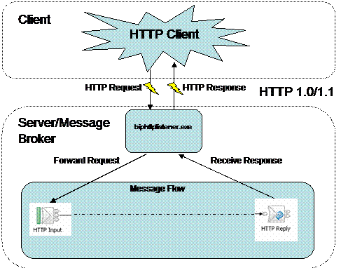

#  AJAX & APIs (3:00)

###  Objectives

- Identify all the HTTP Verbs & their uses.
- Describe APIs and how to make calls and consume API data.
- Access public APIs and get information back.
- Implement a jQuery AJAX client for a simple REST service.
- Reiterate the benefits of separation of concerns – API vs. Client.

> Note: Last class, we learned how to manipulate the DOM using jQuery and
even learned some handlebars.js!

---

<a name = "opening"></a>
## APIs: Introduction (15 min)

Last class we learned the importance of separation of concerns. It's best
practice to separate DOM logic from our data models. This not only allows for
cleaner code, but is an easier way to manipulate our layouts and interaction
. Separation of concerns becomes ever more important when working with
outside data. Let's take a few scenarios where we want to pull data from an
external API:

- Twitter client
- Feed reader
- Weather forecasting app
- Social game sharing high scores
- Any app with user log in

Given the increase in the number of devices and platforms,
[Service Oriented Architectures (SOA)](https://en.wikipedia.org/wiki/Service-oriented_architecture)
have becoming increasingly prevalent and are soon becoming best practice.
SOAs allow us to build one backend/database to share across all of these
platforms. This means that our applications will not only deal with external
APIs, but also rely on these services for our core data.


### API Gotchas

API calls are really a fancy term for making HTTP requests to a server and
sending/receiving structured data from that endpoint. We are still
communicating with URLs, however instead of receiving markup, like we do with
HTML pages, we receive data. If that data is structured as JSON, we can
easily start reacting and communicating with it thanks to the provided JSON
methods.

Because our pages will be fully or partially rendered on the client side
after we receive this data, there are a few best scenarios we need to take
into account:

  - Certain APIs require authentication, and we need to provide an API key
  either as a request parameter, in the header, or in the body of the call.
  - When we make an API call after a user action, we need to give the user
  feedback that something is happening.
  - We update our view(s) only after we get a return from the server.
  - We need to account for us not receiving data back due to different
  interruptions/causes:
    - Server timeout
    - Wrong authentication information
    - User loses connection
    - Request URL not found
- [Representational state transfer (REST)](https://en.wikipedia.org/wiki/Representational_state_transfer)
is the most common architecture style for passing information to and from these API endpoints.

---

## jQuery AJAX (20 minutes)

Vanilla JavaScript AJAX functionality gives us everything we need to make
http requests, however it takes 4-5 steps to make the call and get the
information back, without much other added benefit. Furthermore, certain
older browsers handle AJAX calls differently. We are already familiar with
jQuery's DOM helper methods. Just like with the DOM, jQuery has some very
useful convenience methods to interact with cross platform requests.

jQuery allows us to create quick get and post requests in one step, as
opposed to the above multiple steps.

```js

  //starter_code/01-jquery-ajax/index.html

  // All we need to create a get or post request is use the get or post method
  $.get( 'http://www.omdbapi.com/?s=Star+Wars', function(response) {
      // We get the data back from the request in the parameter we pass in the function
      console.log(response);
  });
```

> Why is the console.log inside a callback? How is that related to asynchronicity?

Get and post methods are very useful and easy to work with, however there
will be scenarios where we need more granularity to handle our requests. The
`$.ajax()` method allows us significantly more granularity.

```js
  $.ajax({
      url: "http://www.omdbapi.com/?s=Star+Wars",
      type: "json"

      // Work with the response
      success: function( response ) {
          console.log( response ); // server response
      }

      /* More Options from http://www.sitepoint.com/use-jquerys-ajax-function/ */
  });
```

## We do: Pseudocode the Movie Browser together

```
$ cd starter_code/02-movie-browser/
$ atom .
# open index.html in browser
```

```js
// hide #movie-select
// on form submit
  // construct url with input value
  // get search from api
    // loop through each result
      // create an <option> 
      // set innerHTML to the current movie title
      // set id to imdbID
      // append that <option> to the select tag
// on select change (delegated event)
  // construct url with selected option
  // get results from api
  // show poster and movie title

```

## You do: Movie Browser

---
<a name = "introduction1"></a>
## HTTP: Recap (25 min)

HTTP is a protocol - a system of rules - that determines how web pages
(see:'hypertext') get sent (see:'transferred') from one place to another.
Among other things, it defines the format of the messages passed between
**HTTP clients** and **HTTP servers**.


Since the web is a service, it works through a combination of
**clients which _make_ requests** and **servers (which _receive_ requests)**.

### HTTP Client

**HTTP Clients make or generate HTTP Requests.** Some types of clients are:

* Browsers - Chrome, Firefox and Safari.
* Command Line programs - [curl](http://curl.haxx.se/docs/)
and [wget](http://www.gnu.org/software/wget/manual/wget.html).

**HTTP Clients respond to HTTP Responses from a Web Server.** They process
the data being returned form a **Web Server, aka HTTP Server.**

### HTTP/Web Server

Two of the most popular **HTTP or Web servers** are
[Apache](http://httpd.apache.org/) and [Nginx](http://nginx.com/), But there
are lots different [web servers](http://en.wikipedia.org/wiki/Comparison_of_web_server_software)
out there. Some web servers are [written in Ruby](https://www.ruby-toolbox.com/categories/web_servers),
while others are written in other languages.

All **Web Servers** receive **HTTP Requests** and generate **HTTP Response **.
*We'll take a deeper look into these later.*

Often Web Servers are just the middleman, passing HTTP Request and Responses
between the client and web application.

> CFU client/server

### Web Applications

Are programs built by a developer, sometimes using a framework like Rails or
Express. These programs plug into a web server, process the **HTTP requests**
that the server receives, and generate **HTTP Responses**.



Lost? Here's the play-by-play.

1. A client sends a **HTTP Request** to a **HTTP Server** running on a remote machine.
  * The **hostname**, given in the URL, indicates which server will receive the request.
2. The **HTTP server** processes the **HTTP Request**. This may entail
passing the request to some **Web Application**, which creates a **HTTP Response**.
3. The response gets sent back to the client.
4. The client processes the response.

---

<a name = "demo"></a>
## HTTP: Demo (30 min)

Lets explore HTTP resources. We'll start by looking at HTTP requests and
responses using the Chrome Inspector.


* In Chrome, open up Chrome Inspector (*command + option + 'i', or ctrl + click and select 'inspect element'*).
* Select the Network tab. It should look something like this:


  You should be able to see a few HTTP Requests and Responses in the Network
  tab; for each request you'll see a **Path**, **Method**, **Status**, **Typ **,
  and **Size**, along with info about how long it took to get each of these
  resources.
  *Most of this information comes from the HTTP Request and Response.*

  * Some HTTP requests are for CSS, JavaScript and images that are referenced
  by the HTML.
  * Select `index.html` in the Path column on the far left.
  * Select the Headers tab. **Headers** are meta-data properties of an HTTP
  request or response, separate from the body of the message.

### HTTP Request

The first word in the request line, **GET**, is the **HTTP Request's Method**.


**HTTP Request Methods:**

* **GET** => Retrieve a resource.
* **POST** => Create a resource.
* **PATCH** (_or **PUT**, but **PATCH** is recommended_) => Update an
existing resource.
* **DELETE** => Delete a resource.

Of these, **GET** and **POST** are the most widely used.

* HTTP version should be 1.1

**[Status Codes](http://en.wikipedia.org/wiki/List_of_HTTP_status_codes)**
have standard meanings; here are a few.

|Code|Reason|
|:---|:-----|
|200| OK
|301| Moved Permanently
|302| Moved Temporarily
|400| Bad Request
|403| Forbidden
|404| Not Found
|500| Internal Server Error

> CFU req/res
> CFU verbs

---

---

<a name = "lab1"></a>
## My Favorite Things: API-ify it! (20 min)

- Refactor your favorite things code to work with an API. In the starter code,
there is a small [nodejs server](starter-code/posts_requests/server.js) which
has all of the API code. You **do not need to change or even understand this code**.
It's only there to provide functionality. 

- Your program should:
  - Populate your list based on the data returned from the API
  - When you add things to the list, they should also be added to the API data

**Bonus**
  - When you remove things from the list, they should also be removed from
  the API data. This functionality does not yet exist, you'll have to
  implement it in the node code!


Getting started:

- cd into `starter-code/posts_requests`
- Enter the command `npm install`
  - This will install all the server code for you (this may take a minute or so)
- When this completes you can now start your server with the command `node server.js`
- You will see an inspirational message!

At this point, you can now start editing the `index.html` - happy coding!

<a name = "lab2"></a>
## Open Weather Map: Independent Practice (30 min)

Let's bring it all together. Open the [main.js](starter-code/04-open-weather-map/main.js)
file. We will talk with a weather API, and retrieve weather information. Thus
far we have worked with just pulling static URLs. Follow the steps below.

  - Sign up for openweathermap.org and generate an API key.
  - User either $.ajax or $.get to pull weather current data for Washington DC (hint: http://api.openweathermap.org/data/2.5/weather?q=...).
  - Print the temperature in console.
  - Bonus 1: add a form prompting user for the city and state.
  - Bonus 2: convert answer from kelvin to fahrenheit.

---
<a name = "conclusion"></a>
## Conclusion (5 min)

- Reiterate the benefits of separation of concerns – API vs. Client.
- Identify all the HTTP Verbs & their uses.
- Implement an AJAX request with Vanilla JS.
- Implement a jQuery AJAX client for a simple REST service.

## Homework

- Please fork and clone this exercise - https://github.com/ga-wdi-exercises/spotify-me
- Submit a pull request with your solution by 6:30pm April 20th

#### Additional Resources

- [jQuery: Ajax][1]
- [Sitepoint: jQuery Ajax][2]
- [MDNL JS Ajax][3]
- [Wikipedia: API][4]
- [What's an HTTP Request?][5]

[1]: https://learn.jquery.com/ajax/
[2]: http://www.sitepoint.com/use-jquerys-ajax-function/
[3]: https://developer.mozilla.org/en-US/docs/AJAX/Getting_Started
[4]: https://en.wikipedia.org/wiki/Application_programming_interface
[5]: http://rve.org.uk/dumprequest
