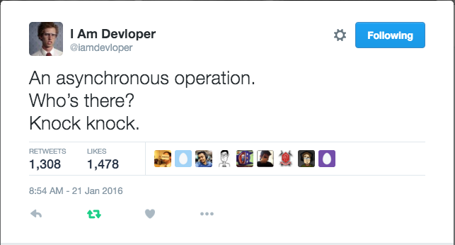

#  Asynchronous JavaScript and Callbacks (3:00)

| Timing | Type | Topic |
| --- | --- | --- |
| 10 min | [Opening](#opening) | Introduction to Asynchronous JavaScript |
| 15 min | [Recap](#recap) | Anonymous Functions and Functions as First-Class Objects: Recap |
| 60 min | [Codealong](#codealong1) | Functions as First-Class Objects |
| 30 min | [Lab](#lab1) | Functions and Callbacks: Independent Practice |
| 30 min | [Codealong](#codealong2)  | Anonymous Functions and IIFEs  |
| 30 min | [Lab](#lab2) | IIFE: Independent Practice  |
| 5 min |  [Conclusion](#conclusion)| Homework, Final Questions & Exit Tickets |


### Objectives
*After this lesson, students will be able to:*

- Store and use anonymous functions in variables.
- Pass functions as arguments to functions that expect them.
- Write functions that take other functions as arguments.
- Return functions from functions.


> Note: Last class, we learned how to implement an AJAX request with Vanilla JS and a jQuery AJAX client. Check with students to make sure that everyone is comfortable with the materials covered in the last class.

<a name = "opening"></a>
## Introduction to Asynchronous JavaScript (10 min)



As our programs start relying on user input/behavior and data that might not be available right away, we need to increasingly start thinking about manipulating our program behavior spread out over a period of time. We refer to this "now and later" programming as asynchronous programming. Believe it or not, we have already used asynchronous programming in our code in previous lessons:

- We have listened for click and mouse events that execute certain code when that event is complete.
- We have waited for a return from an AJAX call, and we have executed code for success and error scenarios.
- We have used native JavaScript functions such as `setTimeout` that ran code after a number of milliseconds.

Although we have used asynchronous programming in our code, we have not discussed _how_ this is all happening. Before we can truly understand how asynchronous programming works in JavaScript, we need to take a deeper look at functions and scope.

### Async flow code along with `setTimeout`

`world. Hello,`

> Note: Sentence example

---
<a name = "recap"></a>
## Anonymous Functions and Functions as First-Class Objects: Recap (15 min)

We have worked with numerous scenarios where we have run a block of code after a user has performed an action. Take the following scenario from our DOM and jQuery continued lesson:

```js
  var $thingListItems = $('#fav-list');

  $thingList.on('mouseleave', 'li', function(e) {
    ...
  });
```

Taking a close look at the jQuery `on()` method, we notice two very important overlooked concepts:

1. The function we are passing into the `on()` method does not have a name, we are just passing the function keyword with an event (e) parameter.
2. The `on()` method is taking a function as one of its parameters.

---
<a name = "codealong1"></a>
##  Functions as First-Class Objects (60 min)

Functions as "first-class objects" is one of JavaScript's most powerful superpowers. It allows us to pass functions as parameters, store them as variables (function expressions), return them from other functions, or just run them ad-hoc without the need to define anything. A function that takes another function or returns a function is called a `higher-order function`.

### Passing functions to functions

```js
  function doGreeting(name) {
    console.log('hello, ' + name)
  }
  
  function greeter(aGreeterFunc) {
  	aGreeterFunc('johnny');
  }
  
  greeter(doGreeting)
```
### Returning functions

Just like we can pass functions as parameters, we can also return functions:

```js
  function greeterFactory(name) {
    var returnedFunc = function() {
      console.log('hello, ' + name);
    }
    return returnedFunc;
  }
  
  function greeter(aGreeterFunc) {
    aGreeterFunc();
  }
  
  greeter( greeterFactory('johnny') );
```

---

<a name = "lab1"></a>
## Functions and Callbacks: Independent Practice (30 mins)

Open the [main.js](starter-code/functions-callbacks-exercise/js/main.js) file.

- Write a function, `countWhereTrue()`, that returns a function returning the number of odd integers in an array.
- `countWhereTrue()` should take a predicate/filter function and return a function, allowing us to enter an array of numbers.

---

<a name = "codealong2"></a>
## Anonymous Functions and IIFEs (30 min)

By this point we have seen various examples of function expressions being passed as callback parameters. Taking the first setTimeout example:

```js
  setTimeout(function(){
      console.log( "Hello world" );
  }, 1000);
```

The above is called an **anonymous function expression** because the function we're passing into `setTimeout()` has no name identifier in it. This is important to understand that function expressions can be anonymous, but function declarations cannot omit the name.

Although it is perfectly legal for us to use anonymous function expressions, and many examples take advantage of them them, including ones we have used up to date, we need to set a new best practice in place. As we increasingly work with function expressions, we should from this point on start naming all of our function expressions because it makes it much easier to stack trace and our code becomes much more readable. So let's change the above code to no longer be an anonymous function:

```js
  setTimeout(function timer(){
      console.log( "Hello world" );
  }, 1000);
```

> Note: Error example

**Invoking Function Expressions Immediately**

We have the ability to execute our function expressions as soon as they are declared. This pattern has become so commonplace, that the JS community gave it a name: Immediately-invoked function expressions (IIFE - pronounced "iffy"). We are familiar with this syntax:

```js
  var countDown = function() {
    var counter;
    for(counter = 3; counter > 0; counter--) {
      console.log(counter);
    }
  }
```

We can transform this to an IIFE and execute the function expression immediately by adding parenthesis at the end of the expression:

```js
  var countDown = function() {
    var counter;
    for(counter = 3; counter > 0; counter--) {
      console.log(counter);
    }
  }();
```

Note that we need to add a semicolon at the end of IFFEs.

IIFEs are just functions, so we can also pass arguments to them:

```js
  var counterStartPoint = 3;

  (function countDown( global ){
    var counter;
    for(counter = global.counterStartPoint; counter > 0; counter--) {
      console.log(counter);
    }

  })( window );

  console.log( counterStartPoint ); // 3
```

The above example highlights a common stylistic practice. Although IIFEs are commonly used with global objects, they can certainly be used inside an enclosing scope.

**What the heck for?**

IIFE's are useful for creating self-contained modules that support private variables. The use of IIFE's are slowly declining due to increase reliance on JS transpilers and preprocessors. Also ES6 (the new version of JS has _actual_ modules. Here's an example

```javascript
	// Since JS doesn't support native private variables, developers (by convention)
	// will precede data they want to regard as "private" by and underscore
	var anObj = {
	  _foo: 'beep',
	
	  getFoo: function() {
	    return this._foo;
	  }
	};
	
	// In this example, we want `anObj._foo` to be treated privately and developers
	// should NOT access this property directly. Instead, they should utilize the 
	// property's getter - `getFoo()`
	var foo = anObj.getFoo(); // 'beep'
	
	// unfortunately there's nothing stopping a dev from doing
	var foo = anObj.getFoo(); // 'beep'
	

	// Using an IIFE we can "hide" the property _foo in the constructor function's scope
	var anotherOne = function() {
	  var _foo = 'bar';
	
	  return {
	    getFoo: function() {
	      return _foo;
	    }
	  };
	}();
	
	var foo = anotherOne.getFoo(); // 'beep'
	
	var foo = anotherOne._foo; // undefined
	
```

---
<a name = "lab2"></a>
## IIFE: Independent Practice (30 min)

Open the [main.js](starter-code/iife-exercise/js/main.js) file.

- Write an IIFE function that takes a timer argument.
- The function will automatically execute and count up every second until the specified argument.
- Use the setTimeout function to count up.
- Hint: a second is the timer passed * 1000 (milliseconds).

---

<a name = "conclusion"></a>
## Conclusion (5 min)
Callbacks and closures are the bread and butter of asynchronous programming. Looking back at our DOM and APIs lessons, our interfaces update on user interactions and/or once we receive data from remote locations. Best practices in JS call for these reactions to be handled in the form of callbacks.

Callbacks, closures, and IIFEs allow us to better organize our code for each scenario, as well as make our functions significantly more dynamic.

Make sure class objectives have been met.

## Homework

Before the next class, make sure that students sign up for an Instagram developer account. **We strongly recommend that students do this before coming to class, as Instagram can block too many requests to create new accounts coming from the same IP address (i.e. the wireless router in the classroom)**. We've created a [set of sign up instructions](instagram.md) that you can pass along to students. In the next class, you'll be reviewing the steps that students took to sign up and then leading an exercise that uses the Instagram API.

**Optional homework:** Students who want an additional challenge can try to complete [this series of functional-programming JavaScript exercises](http://reactivex.io/learnrx/). Be sure to warn students that some of these exercises use methods and syntax that we haven't covered in class and which they will likely need to look up on their own.

#### Further Resources

- [Functions are first class objects in javascript][1]
- [MDN: Declaring and using callbacks][2]
- [Demystifying JavaScript Closures, Callbacks and IIFEs][3]

[1]: http://helephant.com/2008/08/19/functions-are-first-class-objects-in-javascript/
[2]: https://developer.mozilla.org/en-US/docs/Mozilla/js-ctypes/Using_js-ctypes/Declaring_and_Using_Callbacks
[3]: http://www.sitepoint.com/demystifying-javascript-closures-callbacks-iifes/
